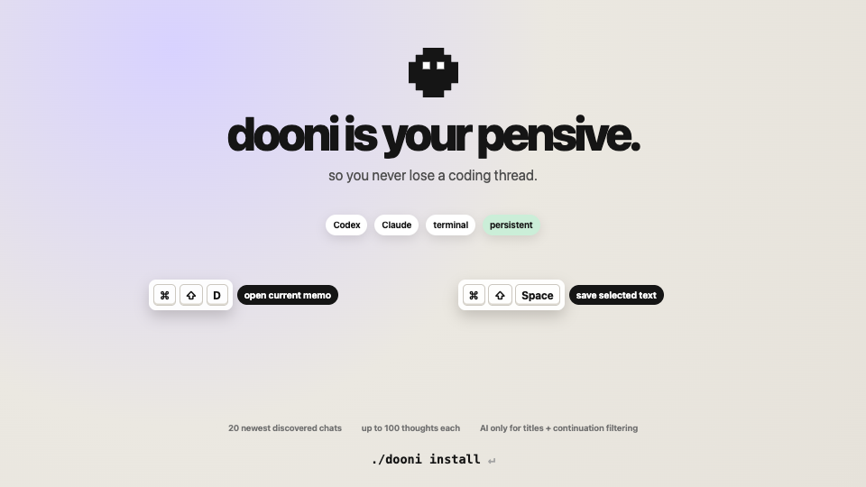

---
covers:
- docs/dooni-demo-poster.png
- docs/dooni-demo.mp4
---
# dooni

a small desktop memo app (installable for mac) with a **to-think list** for saving ideas, questions, and future prompts you cannot yet queue or ask. dooni also automatically tracks your codex and claude coding chats across terminal and app, keeping your past prompts in asked and giving each session space for thoughts, with keyboard shortcuts.

dooni is your pensive so you never lose a thread: save now, ask later!

## Your to-think list

Each chat memo has a thoughts tab that acts as its to-think list. Type ideas, questions, or future prompts, then click to copy, edit, delete, or check them off. dooni does not automatically queue or execute them.

## 60-second demo

[](docs/dooni-demo.mp4)

**[▶ Watch the 60-second dooni demo video](https://github.com/ilovehhhyn/dooni/raw/refs/heads/main/docs/dooni-demo.mp4)**

## Install

Requirements: macOS, Node 18+, Rust stable, Xcode command line tools.

You need the Rust toolchain:

```sh
curl --proto '=https' --tlsv1.2 -sSf https://sh.rustup.rs | sh
source "$HOME/.cargo/env"   # or open a new terminal
xcode-select --install       # if the command line tools aren't installed yet
```

Then:

```sh
git clone https://github.com/ilovehhhyn/dooni.git
cd dooni
./dooni install
```

dooni is free. your macOS keeps the
Accessibility permission you grant it across rebuilds. 

### Claude app tracking

Tracking prompts in the Claude desktop app needs Accessibility permission:
System Settings → Privacy & Security → Accessibility. Claude is an Electron app
and keeps its accessibility tree switched off until asked, so dooni turns it on
and waits up to five seconds for it to build. Claude Code and Codex CLI chats are
read from their history files instead and need no permission.

Codex runtime authentication is the default, so you do not need an API key to start. The Anthropic runtime is optional.

## How to use
- after installation, onboard yourself 
- after signup, dooni shows an empty list. as soon as you talk to any codex or claude agent, your chat will surface on the list. quitting the app does not clear history
- you can retitle the chat by clicking the pencil icon
- you can go to the chat specific memo pad by clicking on the title
- on each memo page, there are two tabs: thoughts and asked.
  - thoughts is the to-think list for ideas, questions, and future prompts you cannot yet queue or ask. save them now to ask later. click a thought to copy it, click the circle to check it off, or edit or delete it. thoughts are not automatically queued or executed.
  - asked contains your historical prompts. click on any of them to be directed to the original chat interface and where the prompt appriximately was.
- the list retains at most the 20 newest admitted chats; older entries and their windows are removed.
- the windows are not pinned by default but you can click the top left circle to pin.
- AI is used only to generate titles and to classify continuation-only prompts.
  
## Keyboard shortcut

`Command-Shift-D` is a global macOS shortcut such that from Codex, Claude, or a terminal, it opens the most recently active surfaced dooni memo pad for that chat, so you can retrace your steps or jot down a new prompt. The shortcut is also documented in Settings.

`Command-Shift-Space` is a global macOS shortcut that saves the text you have selected in a Codex, Claude, or terminal chat into the associated surfaced dooni chat as a new thought. The capture is quiet, and an empty selection does nothing.

- dooni reads the selection through macOS Accessibility first. If that fails, it falls back to a guarded `Command-C`, which restores your previous text clipboard afterward.
- For Claude Desktop, dooni prefers the exact captured conversation ID. For Codex and terminal, it uses the most recently active surfaced session for that source.
- The chat does not need to have surfaced yet: capture matches the current or latest session for the frontmost source, and a successful capture adds that session to the surfaced chats and updates the list immediately. `Command-Shift-D` still works only for chats that have already surfaced. Each chat holds a maximum of 100 thoughts.
- An already-open memo updates immediately on the thoughts tab.

Both shortcuts are also listed in Settings under Manual.

## How to change settings

All settings live in a JSON file:

- macOS: `~/Library/Application Support/dooni/config.json`
- Linux: `~/.config/dooni/config.json`

Edit that file directly, or use `jq` as shown below. **Restart dooni for changes to take effect.**

```sh
CFG=~/Library/Application\ Support/dooni/config.json
```

### How to update API key

An API key is only needed for the optional Anthropic runtime; Codex runtime authentication is the default. Change the key in Settings.

### Reset onboarding

```sh
jq '.onboarded = false' "$CFG" > "$CFG.tmp" && mv "$CFG.tmp" "$CFG"
```

Next launch will show the welcome + onboarding screens again.

## More

See [BUILD_PLAN.md](./BUILD_PLAN.md) for architecture, JSONL parsing rules, prompt design, known limitations, and the full rationale.

<p align="center"></p>
